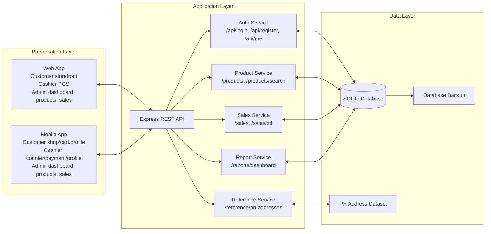
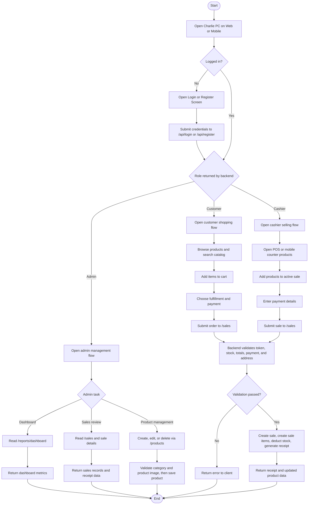
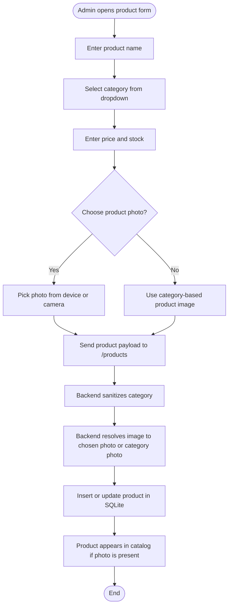

# Updated Charlie PC System Flowchart

This document reflects the current Charlie PC build as of March 27, 2026. It updates the older flowchart view so the diagrams match the actual web app, mobile app, and backend behavior in the latest version.

## What changed in the current version

- Web admin product management now uses a category dropdown and a photo picker instead of a raw image URL field.
- Mobile admin product management also uses category selection and photo picking, with a keyboard-aware scrollable form.
- The mobile cashier experience no longer includes product management. Cashier mobile tabs are limited to counter products, payment, and profile.
- Product creation and updates still pass through the backend, which validates category values and resolves product images before saving.
- The product catalog only returns items that already have photos.
- Receipt generation, stock deduction, and sale recording continue to happen on the backend for both web and mobile.

## 1. Updated system integration flowchart

### Explanation

- Both clients talk only to the Express backend.
- Authentication, checkout, reporting, and product rules stay centralized.
- Web and mobile do not access SQLite directly.
- The backend remains the single source of truth for users, products, sales, and sale items.

## 2. Updated role-based operating flow

### Explanation

- Customers use the shopping flow.
- Cashiers use the selling flow.
- Admins use dashboard, sales, and product management flows.
- Regardless of the role, the backend is still the point where validation and database writes happen.

## 3. Updated product management flow

This flow reflects the latest add/edit product behavior on both web and mobile admin interfaces.

### Notes for the current build

- Web admin no longer uses an image URL textbox.
- Mobile admin no longer uses a barcode textfield in the add/edit form.
- Mobile cashier no longer has access to manage products.
- If an admin resets the image, the backend falls back to the category photo.
- Catalog endpoints only return products with non-empty images, which keeps customer and cashier product lists clean.

## 4. Platform behavior summary

### Web

- Customer flow: browse, search, cart, checkout
- Cashier flow: POS-only selling flow
- Admin flow: dashboard, products, sales

### Mobile

- Customer tabs: Shop, Cart, Profile
- Cashier tabs: Counter Products, Payment, Profile
- Admin tabs: Dashboard, Products, Sales, Profile

## 5. Recommended defense explanation

If you need a short verbal explanation during the defense, you can use this:

> Charlie PC uses one shared backend for both web and mobile. Users log in and are routed by role. Customers browse and check out, cashiers process counter sales, and admins manage products, sales, and dashboard reports. All important actions still pass through the same API, which validates data, updates the SQLite database, deducts stock, and returns receipts or reports. In the updated version, product management is cleaner because categories are controlled through dropdown selection and product images are handled through a real photo picker instead of a raw URL field.
